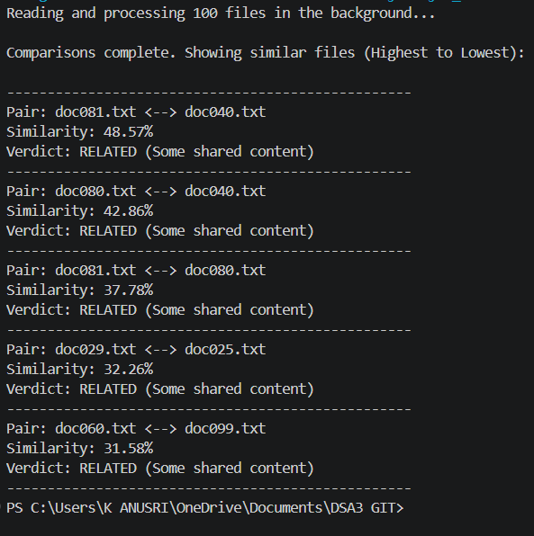

# String Matching Application

## Description

String Matching Application is a Java-based text comparison application designed to identify matching and similar content between text documents.

The application reads multiple `.txt` files from a corpus folder, compares every pair of documents, calculates their similarity percentage, and displays the matching results in the terminal.

## Problem Statement

Comparing multiple documents manually to identify duplicated or similar content is time-consuming and difficult.

The proposed application automates the comparison process by analyzing text documents and calculating a similarity percentage between document pairs. This helps identify documents that contain matching or duplicated content.

## Application

The application is a text string-matching and document comparison system used to find matching or common content between documents.

## Objectives

- To compare multiple text documents automatically.
- To identify matching content between documents.
- To calculate the similarity percentage between document pairs.
- To classify documents based on their similarity level.
- To display the comparison results clearly in the terminal.

## Features

- Reads multiple `.txt` files from a corpus folder.
- Compares every unique pair of documents.
- Uses the Z-Algorithm for string matching.
- Calculates similarity percentage.
- Sorts matching results in descending order.
- Displays the similarity percentage in the terminal.
- Provides a similarity-based classification.

## Algorithm Used

### Z-Algorithm

The Z-Algorithm is a linear-time string matching algorithm used to find occurrences of a pattern within a text.

In this application, document content is divided into text chunks. The Z-Algorithm is used to check whether chunks from one document occur in another document.

## Similarity Calculation

The similarity percentage is calculated using the number of matched chunks between two documents.

```text
Similarity Percentage =
(Matched Chunks / Total Chunks) × 100
```

The application considers the chunks from both documents while calculating the similarity percentage.

## Similarity Classification

The results can be interpreted as:

| Similarity Percentage | Classification |
|----------------------|----------------|
| 80% and above | Completely Duplicated |
| 50% – 79.99% | Moderately Similar |
| Below 50% | Not Duplicated |

## Technologies Used

- Java
- Z-Algorithm
- Java NIO
- Array
- ArrayList
- List
- HashMap
- Text Files (`.txt`)
- VS Code
- Git and GitHub

## Project Structure

```text
DSA3 GIT/
├── images/
│   └── img1.png
├── ProjectCode/
│   ├── corpus/
│   │   ├── doc1.txt
│   │   ├── doc2.txt
│   │   ├── doc3.txt
│   │   └── ...
│   └── DocMatching.java
├── DSA Abstract.pdf
├── DSA Project.pptx
└── README.md
```

## How the Application Works

1. The application looks for the `corpus` folder.
2. It reads all `.txt` files present in the folder.
3. The contents of the documents are preprocessed and divided into chunks.
4. Each unique pair of documents is compared.
5. The Z-Algorithm checks for matching chunks.
6. The similarity percentage is calculated.
7. The results are sorted from highest to lowest similarity.
8. The matching results are displayed in the terminal.

## How to Run

Open the terminal in the `ProjectCode` folder.

Compile the Java program:

```bash
javac DocMatching.java
```

Run the program:

```bash
java DocMatching
```

Make sure the `corpus` folder is present inside the `ProjectCode` folder.

## Sample Output

The following image shows the sample output of the String Matching Application executed in the terminal.



## Applications

- Plagiarism detection
- Duplicate document detection
- Assignment comparison
- Report comparison
- Text content matching
- Document similarity analysis

## Expected Outcome

The application provides an automated way to compare text documents and identify matching content.

It calculates a similarity percentage for document pairs and displays the results in descending order, helping users quickly identify highly similar or duplicated documents.

## Conclusion

The String Matching Application demonstrates the practical use of string matching techniques for document comparison.

By using the Z-Algorithm, the application can efficiently search for matching text chunks and calculate similarity between documents. The project provides a simple terminal-based solution for identifying duplicated and similar textual content.

## Author

**K. Anusri**

**CSE | B.Tech**

**Roll No: 2520030432**